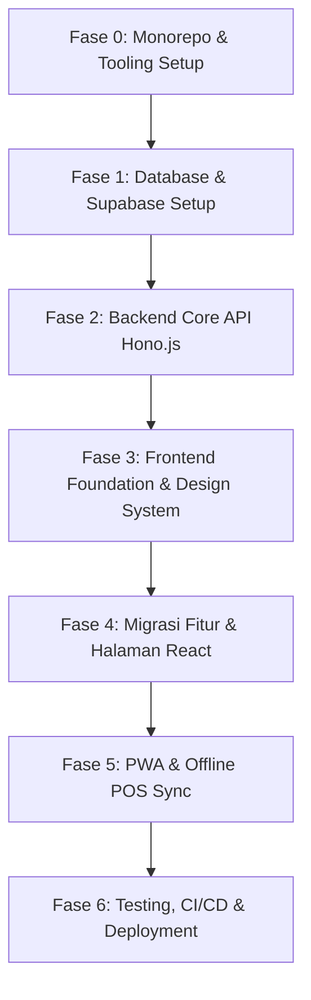

# 🗺️ Pelan Eksekusi Migrasi Serverless StockKu

Dokumen ini adalah rencana kerja bertahap (*Step-by-Step Action Plan*) untuk memigrasikan **StockKu** dari arsitektur monolitik Laravel 12 / PHP / MySQL ke arsitektur modern Serverless: **Hono.js + Supabase (PostgreSQL) + React 19 (Vite) SPA** di **Cloudflare Workers & Pages**.

---

## 🎯 Target Arsitektur Akhir

```
┌─────────────────────────────────────────────────────────────┐
│             Cloudflare Edge Network & CDN                   │
├───────────────────────────────┬─────────────────────────────┤
│  Cloudflare Pages             │  Cloudflare Workers         │
│  (apps/web: React 19 SPA)     │  (apps/api: Hono.js v4 API) │
│  - Vite 6 + Tailwind v4       │  - Edge runtime (~0ms boot) │
│  - Zustand (Cart & UI State)  │  - Drizzle ORM              │
│  - TanStack Query v5          │  - Zod Validation           │
│  - PWA Offline / IndexedDB    │  - Middleware (Auth & Gate) │
└───────────────┬───────────────┴──────────────┬──────────────┘
                │                              │
                │         HTTPS / REST         │
                ▼                              ▼
┌─────────────────────────────────────────────────────────────┐
│                      Supabase Platform                      │
├─────────────────────┬───────────────────┬───────────────────┤
│ PostgreSQL 15 + RLS │ Supabase Auth     │ Supabase Storage  │
│ (Transactions, ACID)│ (JWT & Sessions)  │ (Receipts, Files) │
└─────────────────────┴───────────────────┴───────────────────┘
```

---

## 📅 Roadmap & Fase Eksekusi



---

## 📌 Rincian Tugas per Fase

### 🏗️ FASE 0: Inisialisasi Monorepo & Tooling (Fondasi)
**Tujuan**: Menyiapkan struktur workspace monorepo modern berbasis pnpm & Turborepo tanpa merusak file legacy sebelum migrasi tuntas.

- [ ] **0.1 Setup Root Workspace**
  - Buat `pnpm-workspace.yaml` mencakup `apps/*` dan `packages/*`
  - Buat `turbo.json` untuk pipeline build, test, lint, dan dev orchestration
  - Konfigurasi root `package.json`, `.gitignore`, dan TypeScript base config
- [ ] **0.2 Inisialisasi Paket Bersama (`packages/shared`)**
  - Buat package TypeScript untuk tipe data domain (User, Product, Category, Sale, StockMovement, Attendance)
  - Pindahkan enum, konstanta bisnis, dan skema validasi Zod yang digunakan bersama oleh backend dan frontend
- [ ] **0.3 Inisialisasi Aplikasi Backend (`apps/api`)**
  - Scaffold project Hono.js dengan target runtime Cloudflare Workers
  - Konfigurasi `wrangler.toml`, `tsconfig.json`, dan script `pnpm dev`
- [ ] **0.4 Inisialisasi Aplikasi Frontend (`apps/web`)**
  - Scaffold React 19 + Vite 6 dengan TypeScript
  - Konfigurasi Tailwind CSS v4, path alias `@/*`, dan PWA plugin

---

### 🗄️ FASE 1: Database & Supabase Setup (PostgreSQL)
**Tujuan**: Membangun skema database PostgreSQL di Supabase dengan integritas data setara atau lebih unggul dari MySQL.

- [ ] **1.1 Setup Supabase Project**
  - Inisialisasi lokal via Supabase CLI (`supabase init`)
  - Konfigurasi timezone `Asia/Jakarta` (WIB)
- [ ] **1.2 Migrasi Skema DDL ke PostgreSQL**
  - Konversi tipe data MySQL ke PostgreSQL:
    - Primary key: UUID (`gen_random_uuid()`)
    - Uang: `NUMERIC(15, 2)` dengan constraint `CHECK >= 0`
    - Timestamp: `TIMESTAMPTZ`
    - Status/Flags: `BOOLEAN` dan `CHECK (status IN (...))`
  - Buat tabel-tabel utama:
    - `users` (terintegrasi dengan `auth.users`)
    - `categories`, `suppliers`, `products`, `product_prices`
    - `sales`, `sale_items`, `sale_returns`, `sale_return_items`
    - `purchases`, `purchase_items`
    - `stock_movements`, `price_change_logs`, `activity_logs`
    - `attendances`, `leave_requests`, `settings`
- [ ] **1.3 Implementasi Row Level Security (RLS)**
  - Kebijakan isolasi akses berdasarkan JWT role (Admin, Manager, Kasir, Karyawan)
- [ ] **1.4 Setup Drizzle ORM di `apps/api`**
  - Tulis Drizzle schemas di `apps/api/src/db/schema/`
  - Buat database client wrapper yang mendukung Cloudflare Workers edge environment
  - Setup Drizzle Kit untuk otomatisasi migrasi
- [ ] **1.5 Skrip Migrasi Data (MySQL ke PostgreSQL)**
  - Buat skrip ekstraksi data dari MySQL ke format JSON/SQL insert Supabase
  - Migrasi data akun admin, kategori, supplier, produk, dan stok awal

---

### ⚙️ FASE 2: Backend API Hono.js (`apps/api`)
**Tujuan**: Mengimplementasikan seluruh logika bisnis POS, inventory, dan absensi di edge runtime dengan zero-cold-start.

- [ ] **2.1 Middleware & Security Layer**
  - **Auth Middleware**: Verifikasi token JWT dari Supabase Auth, validasi `is_active`, inject user info ke context
  - **RBAC Middleware**: Enforce role per endpoint (`requireRole(['admin', 'manager'])`)
  - **Attendance Gate Middleware**:
    - Validasi apakah user non-admin sudah clock-in hari ini dan belum clock-out
    - Tolak request mutasi (POST/PUT/PATCH/DELETE) dengan `403 ATTENDANCE_REQUIRED` jika belum absen
    - Admin (owner) dikecualikan (fully exempt)
- [ ] **2.2 Porting Layanan Bisnis (Services)**
  - **`SaleService` (Data Integrity Kritis)**:
    - Transaksi atomik via `db.transaction()`
    - Row-level locking `SELECT ... FOR UPDATE` untuk mencegah race-condition stok
    - Generator nomor invoice sequential harian (`INV-YYYYMMDD-0001`)
    - Validasi batas diskon dan syarat `bayar >= grand_total`
    - Proses return barang capped dengan `returned_qty` tracking
  - **`StockService`**:
    - Pencatatan mutasi masuk, keluar, dan adjustment
    - Strict validation: lempar error jika mutasi keluar menyebabkan stok negatif
  - **`ProductService`, `CategoryService`, `SupplierService`**: CRUD dan manajemen harga grosir
  - **`PurchaseService`**: Pencatatan restock dan penambahan kuantitas stok otomatis
  - **`ReportService`**: Laporan ringkasan penjualan, laba-rugi, mutasi stok, dan absensi
  - **`AttendanceService`**: Clock-in, clock-out, pengajuan izin/cuti/sakit, dan approval
- [ ] **2.3 Endpoints & Validasi Input (Zod)**
  - Implementasi route handlers tipis (*skinny controllers*) di `apps/api/src/routes/`
  - Validasi schema Zod via `@hono/zod-validator` untuk seluruh payload
- [ ] **2.4 Testing Backend**
  - Tulis unit & integration tests dengan Vitest di `apps/api/src/__tests__/`
  - Pastikan semua rule data integrity (stok tidak boleh negatif, invoice berurutan, attendance gate) memiliki test coverage

---

### 🎨 FASE 3: Frontend Foundation & Design System (`apps/web`)
**Tujuan**: Membangun fondasi SPA React 19 yang responsif, berestetika premium, dan siap menampung seluruh fitur POS.

- [ ] **3.1 Setup Core & Routing**
  - Konfigurasi React Router v7 dengan lazy loading per halaman
  - Setup API client (`src/api/client.ts`) dengan auto-attach token JWT dan penanganan otomatis `403 ATTENDANCE_REQUIRED`
- [ ] **3.2 State Management & Client Cache**
  - Konfigurasi TanStack Query v5 untuk server state caching
  - Setup Zustand stores:
    - `auth.store.ts`: Status sesi dan profile user
    - `cart.store.ts`: Keranjang belanja kasir (dengan middleware `persist` ke localStorage)
    - `ui.store.ts`: State modal, sidebar, dan toast notifikasi
- [ ] **3.3 Design System & Komponen UI**
  - Palet warna konsisten: indigo/purple (primary), emerald/teal (success/money), amber (warning), slate (neutral)
  - Komponen reusable: Button, Input, Modal, Dropdown, Table, Badge, Card, StatMetric
  - Komponen Banner Status Absensi (`<AttendanceBanner />`) yang tampil saat mode baca aktif
  - Global Toast notification system

---

### 💻 FASE 4: Implementasi Modul & Halaman Frontend
**Tujuan**: Membangun ulang seluruh halaman Blade + Livewire menjadi komponen React interaktif.

- [ ] **4.1 Terminal POS (Kasir)**
  - Input barcode scanner berkecepatan tinggi (`<BarcodeInput />`) tanpa delay debounce
  - Grid & pencarian produk cepat (SKU, barcode, nama produk)
  - Manajemen keranjang belanja: tambah, kurangi, hapus item, diskon per item, diskon transaksi
  - Modal pembayaran: tombol pecahan uang cepat, kalkulasi kembalian otomatis
  - Modal sukses transaksi & dialog cetak struk thermal / PDF
- [ ] **4.2 Manajemen Produk & Inventori**
  - Daftar produk dengan pagination, filter kategori, status stok minimum
  - Form tambah & edit produk dengan dukungan harga eceran dan grosir bertingkat
  - Manajemen kategori & supplier
  - Terminal restock / pembelian barang masuk
  - Riwayat log mutasi stok barang
- [ ] **4.3 Modul Absensi & Karyawan**
  - Halaman clock-in & clock-out karyawan
  - Form pengajuan izin / sakit / cuti
  - Panel approval absensi untuk Manager & Admin
  - Manajemen akun karyawan & toggle status aktif
- [ ] **4.4 Dashboard & Laporan Interaktif**
  - Dashboard eksekutif: ringkasan penjualan harian, omset, transaksi aktif, grafik tren
  - Laporan penjualan terperinci dengan filter tanggal & kasir
  - Laporan laba kotor & bersih
  - Ekspor laporan ke format Excel (`xlsx`) dan PDF langsung di sisi klien
- [ ] **4.5 Pengaturan & Log Aktivitas**
  - Pengaturan informasi toko, printer struk, dan default diskon
  - Log audit aktivitas pengguna

---

### 📶 FASE 5: Offline Mode & Dukungan PWA
**Tujuan**: Memastikan kasir tetap dapat melayani transaksi meskipun koneksi internet terputus.

- [ ] **5.1 Konfigurasi Service Worker & Manifest**
  - Setup PWA manifest (nama aplikasi, icon, tema, display standalone)
  - Cache static assets (HTML, CSS, JS bundle, ikon)
- [ ] **5.2 Penyimpanan Lokal & Antrean Offline**
  - Simpan katalog produk di IndexedDB untuk pencarian offline
  - Simpan transaksi offline ke dalam antrean IndexedDB (`unsynced_sales`)
- [ ] **5.3 Sinkronisasi Otomatis**
  - Listener status online/offline pada browser
  - Endpoint backend `POST /api/sales/sync` untuk memproses antrean secara batch saat online kembali
  - Tampilan indikator koneksi di antarmuka kasir

---

### 🚀 FASE 6: Pengujian, CI/CD & Peluncuran
**Tujuan**: Otomatisasi deployment dan peluncuran tanpa downtime.

- [ ] **6.1 Pipeline CI/CD (GitHub Actions)**
  - Workflow validasi: linting, TypeScript type-check, dan unit test
  - Workflow deployment otomatis ke Cloudflare Workers (`apps/api`) dan Pages (`apps/web`) saat push ke `main`
- [ ] **6.2 Verifikasi Akhir & Smoke Test**
  - Uji alur transaksi kasir end-to-end
  - Uji validasi stok dan konkurensi (mencegah double sell)
  - Uji attendance gate (pemblokiran transaksi tanpa absen)
  - Verifikasi hak akses role admin, manager, dan kasir
- [ ] **6.3 Cutover Domain & Go-Live**
  - Hubungkan domain kustom via Cloudflare DNS:
    - Frontend: `stockku.com` / `pos.tokombaemi.com`
    - API: `api.stockku.com`
  - Arsipkan direktori server lama (PHP/Nginx VPS)

---

## 🔒 Aturan Integritas Data yang Wajib Dipatuhi

1. **Stok Selalu Dijaga di Server**: Semua pengurangan stok transaksi penjualan dijalankan dalam `db.transaction()` dengan `SELECT ... FOR UPDATE`.
2. **Larangan Stok Negatif**: `StockService.recordMovement` harus melempar error jika mutasi keluar menyebabkan kuantitas di bawah 0.
3. **Pembayaran Valid**: `bayar >= grand_total` dan `diskon <= subtotal` wajib divalidasi ketat di sisi server.
4. **Attendance Gate Aktif**: Mutasi data oleh user non-admin tanpa absensi aktif hari ini wajib ditolak dengan HTTP 403.
5. **Format Invoice Konsisten**: `INV-YYYYMMDD-0001` per hari.
